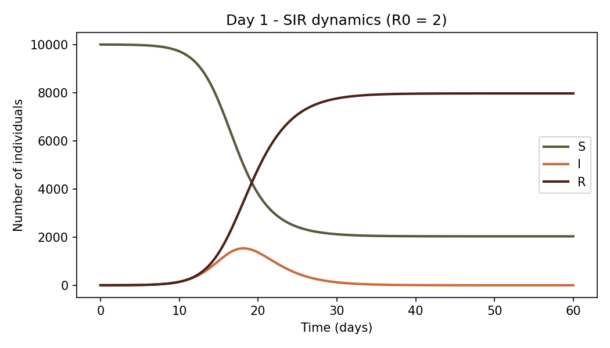
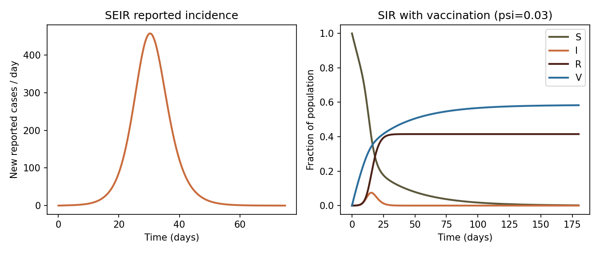
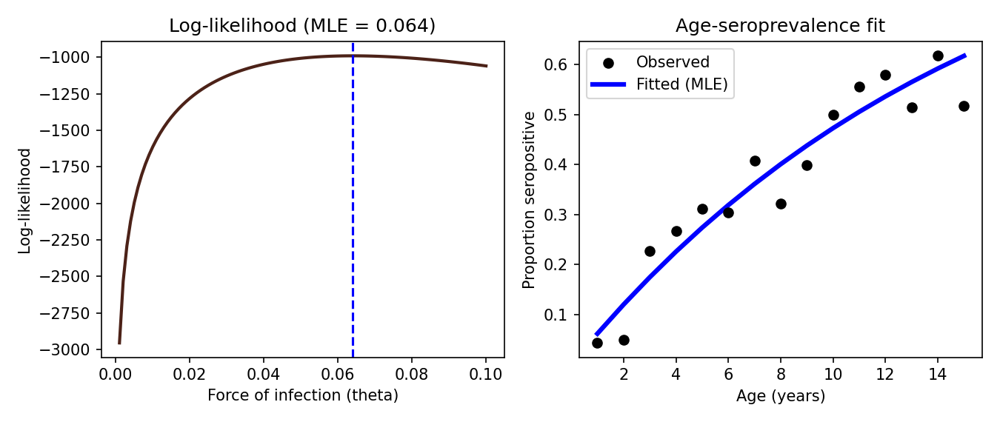
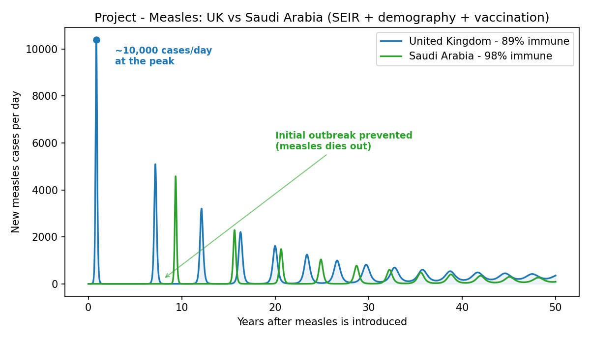
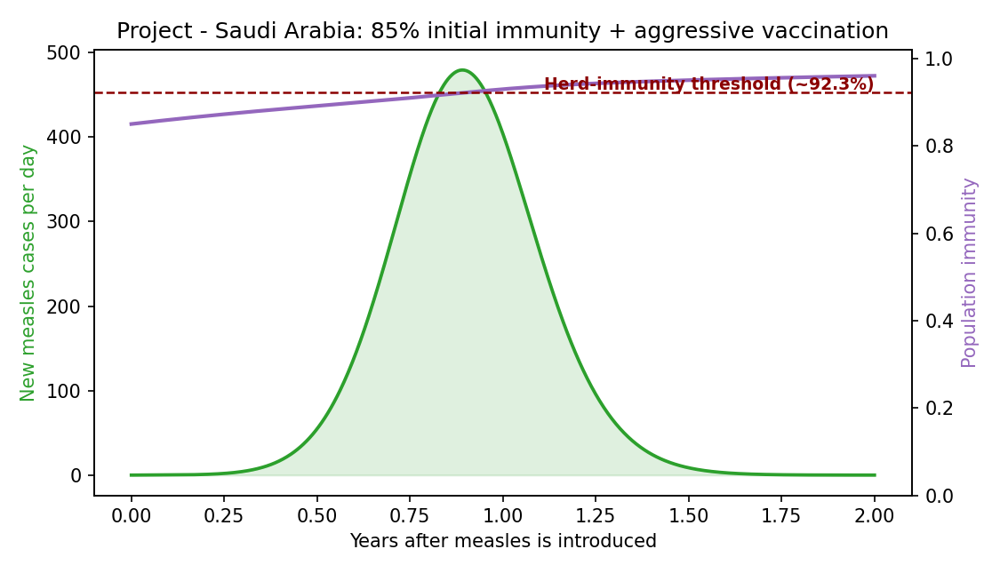

# Epidemiological Modelling: Compartmental Models, Interventions, and Serology

This document summarizes Cambridge Week 1, which covers mathematical modelling of infectious disease dynamics in R — building and numerically solving compartmental (SIR-type) models, extending them to represent public health interventions, comparing model output to data, and fitting serocatalytic models to serological survey data. All simulations use the `deSolve` package to integrate systems of ordinary differential equations (ODEs).

## Day 1: Introduction to Mathematical Modelling & Simulating ODEs in R

### Introduction to mathematical modelling
Mathematical models make the assumptions about how a disease spreads explicit and let us reason quantitatively about outbreaks. The workhorse is the compartmental **SIR** framework, which divides a population of size $N$ into Susceptible ($S$), Infectious ($I$), and Recovered ($R$) individuals and describes the flow between them with a set of coupled ODEs. Two parameters drive the dynamics: the transmission rate `beta` (the rate at which infectious individuals generate new infections) and the recovery rate `gamma` (the rate at which infectious individuals recover, so `1/gamma` is the mean infectious period). Their ratio defines the **basic reproduction number** $\mathcal{R}_0 = \beta / \gamma$, the average number of secondary infections produced by a single case in a fully susceptible population. When $\mathcal{R}_0 > 1$ an epidemic can grow; when $\mathcal{R}_0 < 1$ it dies out.

### Simulating ODEs in R
Because SIR-type models rarely have closed-form solutions, we solve them numerically. In R this is done by writing a function that returns the derivatives (`dS`, `dI`, `dR`) for the current state and passing it to `deSolve::ode()` together with an initial state, a parameter vector, and a sequence of time points. A useful analytical shortcut links the **final epidemic size** $r_\infty$ (the proportion of the population ever infected) to $\mathcal{R}_0$ through $r_\infty = 1 - \exp(-\mathcal{R}_0 r_\infty)$, which can be rearranged to estimate $\mathcal{R}_0$ from an observed attack rate, or solved iteratively (e.g. with `optimize()`) to predict the final size for a given $\mathcal{R}_0$.

```R
# Day 1: Estimating R0 and numerically solving an SIR model
library(deSolve)
library(dplyr)
library(tidyr)
library(ggplot2)

# --- Estimate R0 from the final epidemic size ---
# Rearranged final-size equation: R0 = -ln(1 - r_inf) / r_inf
my_R0 <- function(r_inf) {
  -log(1 - r_inf) / r_inf
}
my_R0(0.24) |> round(2)   # H1N1 influenza (24% infected) -> ~1.15
my_R0(0.77) |> round(2)   # Measles (77% infected)        -> ~1.91

# --- Solve the final-size equation the other way (find r_inf given R0) ---
objective_function <- function(r_inf, R0) {
  abs(r_inf - (1 - exp(-R0 * r_inf)))   # difference between both sides
}
# Minimise the difference to recover r_inf for R0 = 1.5
res <- optimize(function(r) objective_function(r, 1.5), interval = c(0, 1))
cat("R0 = 1.5 -> final size r_inf =", round(res$minimum, 2), "\n")

# --- Define the SIR model as a system of ODEs ---
sir_model <- function(time, compartments, parameters) {
  with(as.list(c(compartments, parameters)), {
    dS <- -par_beta * S * I / par_N
    dI <-  par_beta * S * I / par_N - par_gamma * I
    dR <-  par_gamma * I
    list(c(dS, dI, dR))
  })
}

# Initial state: 1 infectious individual in a population of 10,000
par_N        <- 10000
compartments <- c(S = 9999, I = 1, R = 0)
parameters   <- c(par_beta = 1, par_gamma = 0.5, par_N = par_N)  # R0 = beta/gamma = 2
times        <- seq(0, 60, by = 1/8)                             # simulate 60 days

# Numerically integrate the ODEs
out <- ode(y = compartments, times = times,
           func = sir_model, parms = parameters) |> as.data.frame()

# Reshape to long format and plot the S, I, R curves
out |>
  pivot_longer(-time, names_to = "Compartment") |>
  mutate(Compartment = factor(Compartment, levels = c("S", "I", "R"))) |>
  ggplot(aes(time, value, colour = Compartment)) +
  geom_line(linewidth = 1.2) +
  labs(x = "Time (days)", y = "Number of individuals") +
  theme_classic()
```



With $\mathcal{R}_0 = 2$, susceptibles are depleted as the infectious curve rises and falls, and the epidemic ends well before everyone is infected — the final size matches $r_\infty = 1 - \exp(-\mathcal{R}_0 r_\infty)$.

## Day 2: Modelling Public Health Interventions & Comparing Models to Data

### Incidence and model extensions
The raw SIR compartments track *prevalence* (how many people are currently in each state), but surveillance data usually report **incidence** — the number of *new* cases per time step. Incidence is recovered by adding a cumulative-case compartment `C` that accumulates new infections, then differencing it. The basic SIR model is also extended to capture more biological and demographic realism. The **SEIR** model inserts an Exposed compartment `E` (a latent period before individuals become infectious, governed by `sigma`), and a reporting fraction `rho` can be layered on to mimic imperfect case ascertainment. Adding **demography** (birth and death rate `mu`) allows the susceptible pool to be replenished over time, which can drive recurrent epidemic waves and an endemic equilibrium rather than a single outbreak.

### Interventions, vaccination, and the herd-immunity threshold
Public health interventions are represented by modifying the flows in the model. **Vaccination** is added as a rate `psi` that moves individuals directly from Susceptible to a Vaccinated compartment `V`, removing them from the transmission chain. The **herd-immunity threshold (HIT)** is the fraction of the population that must be immune for transmission to stop, given by $1 - 1/\mathcal{R}_0$; once the immune (or vaccinated) fraction exceeds this, the effective reproduction number falls below 1 and the epidemic cannot take off. These extensions let us ask policy-relevant questions about how strongly and how early an intervention must act to change an outbreak's trajectory.

### Comparing models to data
A model is only useful if it can be confronted with observations. This session introduced the logic of comparing simulated incidence to reported case data — accounting for reporting delays and under-reporting — as the bridge from mechanistic simulation toward statistical inference and parameter estimation, which is developed further with the serocatalytic models on Day 3.

```R
# Day 2: SEIR with reporting, SIR with demography, and vaccination
library(deSolve); library(dplyr); library(tidyr); library(ggplot2)

# --- SEIR model with a cumulative reported-case compartment (C) ---
seir_model <- function(time, compartments, parameters) {
  with(as.list(c(compartments, parameters)), {
    dS <- -par_beta * S * I / par_N
    dE <-  par_beta * S * I / par_N - par_sigma * E   # latency
    dI <-  par_sigma * E - par_gamma * I
    dR <-  par_gamma * I
    dC <-  par_rho * par_sigma * E                    # new reported cases
    list(c(dS, dE, dI, dR, dC))
  })
}
par_N        <- 10000
compartments <- c(S = 9999, E = 0, I = 1, R = 0, C = 0)
parameters   <- c(par_beta = 1.25, par_sigma = 1/2, par_gamma = 1/2,
                  par_N = par_N, par_rho = 0.75)   # rho = 75% of cases reported
out_seir <- ode(y = compartments, times = seq(0, 75, by = 1/8),
                func = seir_model, parms = parameters) |> as.data.frame()
# Incidence = day-to-day increase in the cumulative compartment C
out_seir <- out_seir |> mutate(incidence = c(0, diff(C)))

# --- SIR with demography (births & deaths at rate mu) -> endemic dynamics ---
sir_demo_model <- function(time, compartments, parameters) {
  with(as.list(c(compartments, parameters)), {
    N  <- S + I + R
    dS <- par_mu * N - par_beta * S * I / N - par_mu * S
    dI <- par_beta * S * I / N - par_gamma * I - par_mu * I
    dR <- par_gamma * I - par_mu * R
    list(c(dS, dI, dR))
  })
}
demo_parms <- c(par_beta = 10/7, par_gamma = 1/7,
                par_mu = 1 / (70 * 365))          # 70-year life expectancy
demo_init  <- c(S = 1e7 - 10, I = 10, R = 0)
out_demo <- ode(y = demo_init, times = seq(0, 100 * 365, by = 1),
                func = sir_demo_model, parms = demo_parms,
                method = "lsoda") |> as.data.frame()

# --- Vaccination: move susceptibles to V at rate psi ---
sir_vac_model <- function(time, compartments, parameters) {
  with(as.list(c(compartments, parameters)), {
    dS <- -par_beta * S * I / par_N - par_psi * S
    dI <-  par_beta * S * I / par_N - par_gamma * I
    dR <-  par_gamma * I
    dV <-  par_psi * S                              # newly vaccinated
    list(c(dS, dI, dR, dV))
  })
}
vac_parms <- c(par_beta = 1.25, par_gamma = 1/2, par_psi = 0.03, par_N = 10000)
out_vac <- ode(y = c(S = 9999, I = 1, R = 0, V = 0),
               times = seq(0, 180, by = 1/8),
               func = sir_vac_model, parms = vac_parms) |> as.data.frame()

# Herd-immunity threshold for R0 = beta/gamma = 2.5
R0  <- 1.25 / 0.5
HIT <- 1 - 1 / R0                                   # = 0.6 (60% must be immune)
cat("R0 =", R0, " Herd-immunity threshold =", HIT, "\n")
```



The SEIR curve shows reported new cases building after a latent delay; adding a vaccination flow steadily drains the susceptible pool into the Vaccinated compartment, blunting the outbreak.

## Day 3: Introduction to Serology & Serocatalytic Models

### Introduction to serology
Serological surveys measure antibodies (e.g. IgG) in blood samples to determine who has previously been infected — a direct read-out of accumulated immunity in a population. Because older individuals have had more time to be exposed, the proportion seropositive typically rises with age, and the *shape* of that age–seroprevalence curve encodes the historical intensity of transmission.

### Serocatalytic models
A **serocatalytic model** formalises this idea. Assuming a constant **force of infection** `theta` (the per-capita rate at which susceptibles become infected each year), the expected proportion seropositive at age $a$ is $1 - \exp(-\theta a)$ — the same mathematical form as the final-size relationship, reflecting a cumulative-risk process. The force of infection is estimated from cross-sectional serosurvey data by **maximum likelihood**: writing the log-likelihood of the observed IgG status across all individuals as a function of `theta`, evaluating it over a grid (or optimising it), and taking the value that maximises it as the maximum-likelihood estimate (MLE). Overlaying the fitted curve on the observed seroprevalence-by-age points shows how well a single constant force of infection explains the data.

```R
# Day 3: Fitting a serocatalytic model by maximum likelihood
dat <- read.csv("data/SeroStudy.csv")   # columns include Age, Sex, IgG (0/1)
head(dat)

# Quick exploration
summary(dat$Age)
mean(dat$IgG[dat$Sex == "Male"])
mean(dat$IgG[dat$Sex == "Female"])

# Observed proportion seropositive at each age (1-15 years)
ages      <- 1:15
PropByAge <- sapply(ages, function(a) mean(dat$IgG[dat$Age == a]))
plot(ages, PropByAge, pch = 20,
     xlab = "Age", ylab = "Proportion seropositive")

# Model: under a constant force of infection theta,
# expected seroprevalence at age a is 1 - exp(-theta * a)
theta <- 0.05
lines(ages, 1 - exp(-theta * ages))

# Grid-search the log-likelihood over candidate theta values
thetas    <- seq(0.001, 0.1, 0.001)
llByTheta <- sapply(thetas, function(th) {
  ll <- (1 - dat$IgG) * (-th * dat$Age) +          # contribution of seronegatives
        dat$IgG * log(1 - exp(-th * dat$Age))      # contribution of seropositives
  sum(ll)
})
plot(thetas, llByTheta, type = "l",
     xlab = "Force of infection (theta)", ylab = "Log-likelihood")

# Maximum-likelihood estimate of the force of infection
MLE <- thetas[which.max(llByTheta)]
cat("MLE of force of infection =", MLE, "\n")

# Overlay the fitted curve (blue) on the observed data
plot(ages, PropByAge, pch = 20, xlab = "Age", ylab = "Proportion seropositive")
lines(ages, 1 - exp(-MLE * ages), col = "blue", lwd = 3)
```



The log-likelihood peaks at a force of infection of about 0.064/year; the fitted curve $1 - \exp(-\theta a)$ closely tracks the observed rise in seropositivity with age.

## Day 4 & 5: Self-Directed Project & Presentations

### My project: comparing measles outbreak risk in the UK vs Saudi Arabia
For the self-directed analysis I built a full **SEIR model with demography and vaccination** to ask how vulnerable two countries would be to a re-introduction of measles, given their different levels of population immunity. The model adds an Exposed compartment `E` (latent period `1/sigma` = 8 days), an Infectious compartment `I` (infectious period `1/gamma` = 5 days), vital dynamics (births and deaths at rate `mu`, set from each country's life expectancy), and a continuous vaccination flow `psi` moving susceptibles into a Vaccinated compartment `V`. A cumulative compartment `C` tracks reported cases (reporting fraction `rho` = 0.15), and daily new cases are recovered as `rho * sigma * E`. For each country the transmission rate is back-calculated from its target $\mathcal{R}_0$ using the SEIR-with-demography relationship $\beta = \mathcal{R}_0 (\sigma + \mu)(\gamma + \mu) / \sigma$.

I parameterised two scenarios: the **UK** (population 66.8M, $\mathcal{R}_0 = 15$, 89% initially immune) and **Saudi Arabia** (population 30.9M, $\mathcal{R}_0 = 13$, 98% initially immune), and simulated 50 years after a single imported case.

### Main findings
The two countries sit on opposite sides of the **herd-immunity threshold** (HIT = $1 - 1/\mathcal{R}_0$ ≈ 92–93%). With only 89% immunity, the UK falls below its threshold and suffers an immediate explosive outbreak peaking at roughly **10,000 reported cases per day**, followed by recurrent waves as births slowly replenish the susceptible pool. Saudi Arabia, starting at 98% immunity (above its HIT), prevents the initial outbreak entirely — measles dies out before it can spread — though smaller delayed waves eventually appear once demographic turnover erodes immunity. A second scenario lowered Saudi Arabia's starting immunity to 85% and paired it with an aggressive vaccination campaign (`psi` = 0.002/day), showing how quickly a catch-up campaign can push the immune fraction back above the herd-immunity threshold and suppress transmission. The key takeaway: for a pathogen as transmissible as measles, the margin between 89% and 98% immunity is the difference between a major epidemic and none at all. Each student presents 1-2 slides on their analysis, findings, difficulties, and next steps in the Day 5 discussion.

```R
# Day 4 & 5: SEIR + demography + vaccination — measles, UK vs Saudi Arabia
library(deSolve); library(dplyr); library(ggplot2); library(tidyr)

seir_full_model <- function(time, compartments, parameters) {
  with(as.list(c(compartments, parameters)), {
    N  <- S + E + I + R + V
    dS <- (par_mu * N) - (par_beta * S * I / N) - (par_mu * S) - (par_psi * S)
    dE <- (par_beta * S * I / N) - (par_sigma * E) - (par_mu * E)   # latency
    dI <- (par_sigma * E) - (par_gamma * I) - (par_mu * I)
    dR <- (par_gamma * I) - (par_mu * R)
    dV <- (par_psi * S)   - (par_mu * V)                            # vaccinated
    dC <- par_rho * par_sigma * E                                  # reported cases
    list(c(dS, dE, dI, dR, dV, dC))
  })
}

# --- Shared natural history ---
sigma_val <- 1/8    # 8-day latent period
gamma_val <- 1/5    # 5-day infectious period
rho_val   <- 0.15   # reporting fraction

# --- Country parameters (beta derived from R0 for SEIR + demography) ---
# UK
N_uk   <- 66805830; R0_uk <- 15; mu_uk <- 1/(82*365)
beta_uk <- R0_uk * (sigma_val + mu_uk) * (gamma_val + mu_uk) / sigma_val
# Saudi Arabia
N_sa   <- 30906342; R0_sa <- 13; mu_sa <- 1/(76*365)
beta_sa <- R0_sa * (sigma_val + mu_sa) * (gamma_val + mu_sa) / sigma_val

params_uk <- c(par_beta = beta_uk, par_sigma = sigma_val, par_gamma = gamma_val,
               par_mu = mu_uk, par_psi = 0.00001, par_rho = rho_val)
params_sa <- c(par_beta = beta_sa, par_sigma = sigma_val, par_gamma = gamma_val,
               par_mu = mu_sa, par_psi = 0.00001, par_rho = rho_val)

# vac = fraction already immune when measles is introduced
run_seir <- function(N_pop, params, vac) {
  compartments <- c(S = (1 - vac) * N_pop - 1, E = 0, I = 1,
                    R = vac * N_pop, V = 0, C = 0)
  ode(y = compartments, times = seq(0, 50 * 365, by = 1),
      func = seir_full_model, parms = params, method = "lsoda") |> as.data.frame()
}

out_uk <- run_seir(N_uk, params_uk, vac = 0.89)   # UK below its HIT
out_sa <- run_seir(N_sa, params_sa, vac = 0.98)   # Saudi above its HIT

# Daily new reported cases = rho * sigma * E
out_uk$new_cases <- rho_val * sigma_val * out_uk$E
out_sa$new_cases <- rho_val * sigma_val * out_sa$E

# Herd-immunity thresholds
cat("UK HIT =", round(1 - 1/R0_uk, 3), " Saudi HIT =", round(1 - 1/R0_sa, 3), "\n")

# Plot new cases per day for both countries
bind_rows(mutate(out_uk, country = "United Kingdom — 89% immune"),
          mutate(out_sa, country = "Saudi Arabia — 98% immune")) |>
  ggplot(aes(time / 365, new_cases, colour = country)) +
  geom_line(linewidth = 1.1) +
  labs(x = "Years after measles is introduced",
       y = "New measles cases per day", colour = NULL) +
  theme_minimal()
```



The UK (89% immune, below its ~93% herd-immunity threshold) suffers an immediate outbreak peaking near 10,000 reported cases/day; Saudi Arabia (98% immune) prevents the initial outbreak entirely, with smaller waves emerging only decades later as births replenish susceptibles.



In a lower-immunity scenario (85% start + aggressive vaccination, `psi` = 0.002/day), the immunity level climbs back above the herd-immunity threshold (dashed red, ~92.3%) and cases collapse.

# URLs
- Week 1 programme & timetable: https://sites.google.com/cam.ac.uk/kaust-summer-school-2026/programme/week-1
