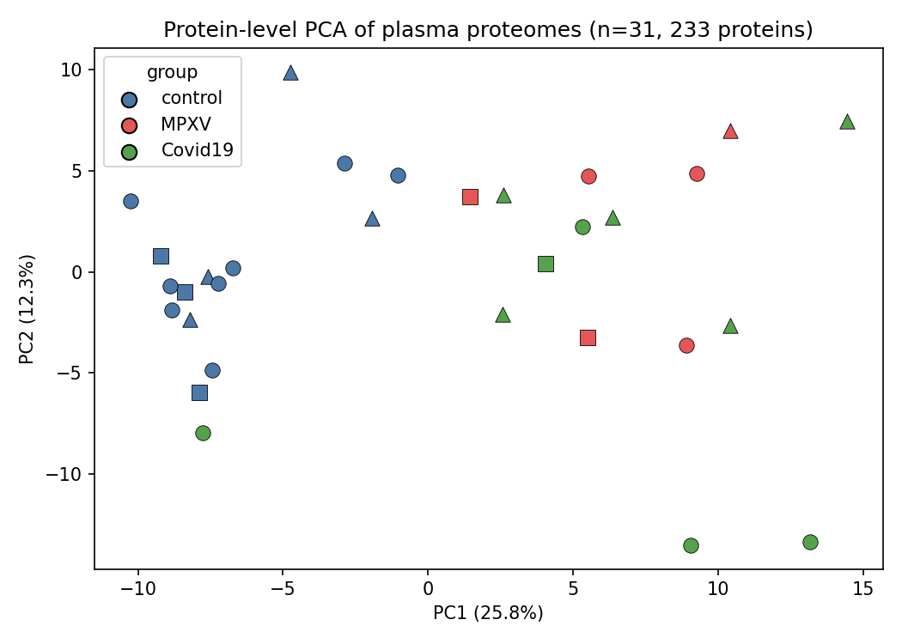
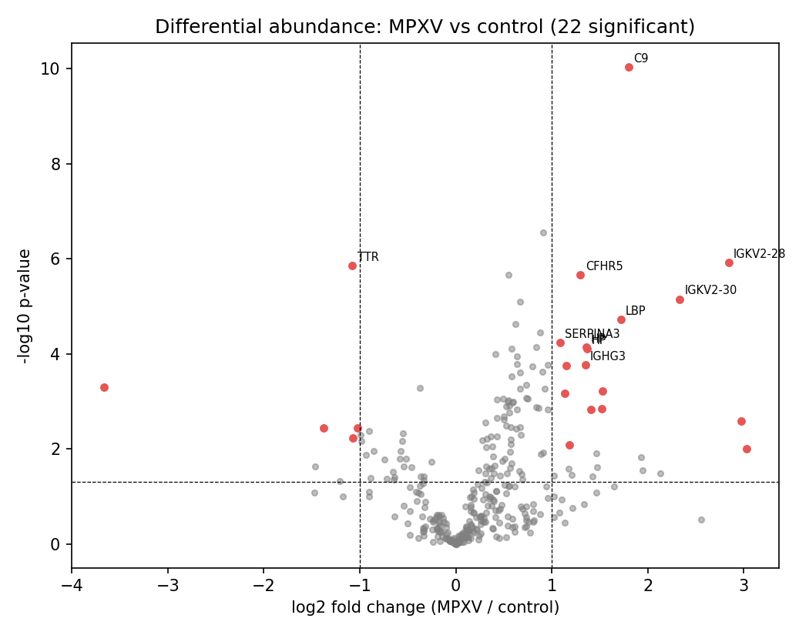
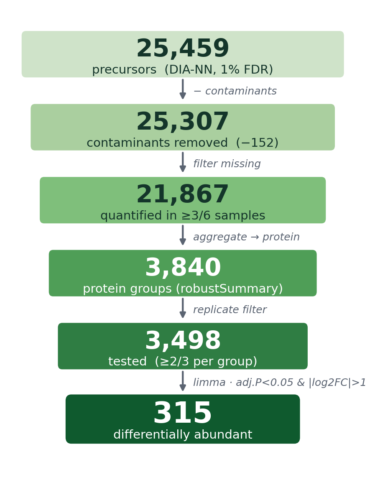
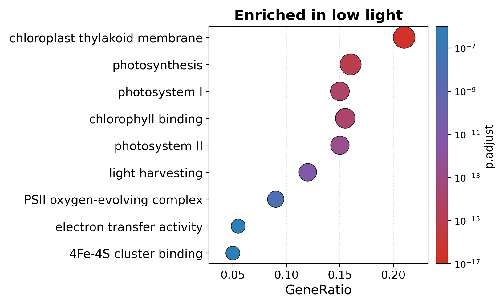
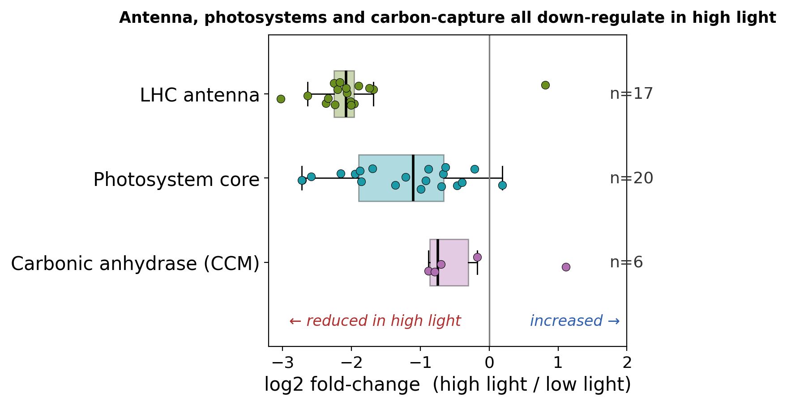
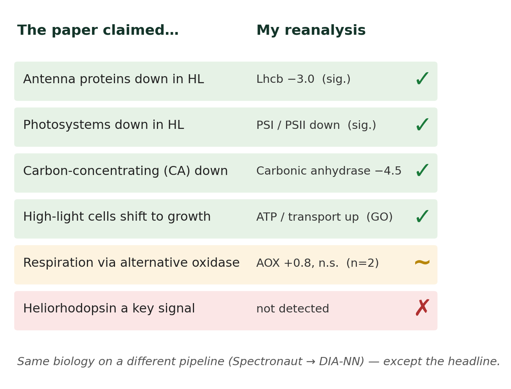

# Expression Proteomics: Analysing DIA Mass-Spectrometry Data in R

This document summarizes Cambridge Week 2, which covers the analysis of quantitative expression proteomics data from data-independent acquisition (DIA) mass spectrometry. Working in R/Bioconductor, the week builds a complete pipeline — importing a DIA-NN report into a `QFeatures` object, cleaning and filtering identifications, normalising and aggregating precursors to proteins, exploring the data, testing for differential abundance with `limma`, visualising results, and interpreting them through functional (GO) enrichment. The instructor-led example uses a plasma proteome dataset comparing monkeypox (MPXV) and COVID-19 patients against healthy controls (Wang et al., 2019).

## Day 1: Import, Infrastructure, Data Cleaning & Normalisation

### Introduction to DIA and the QFeatures infrastructure
In data-independent acquisition, the mass spectrometer fragments **all** precursors within staggered m/z windows rather than picking individual peaks, giving deep, reproducible quantification across samples. The search engine **DIA-NN** outputs a long report (here a `.parquet` file) with one row per precursor per run. The analysis begins by reading this report with `arrow::read_parquet()`, cleaning the `Run` names to match the sample metadata, and loading everything into a **`QFeatures`** object — a Bioconductor container that holds linked assays (precursor → protein) alongside row metadata (`rowData`) and sample metadata (`colData`), so that filtering and aggregation propagate consistently across levels.

### Data cleaning: Q-values, contaminants, and missing values
Raw identifications are filtered to a 1% false-discovery rate by applying a `Q.Value <= 0.01` threshold (and its protein-group and library-level equivalents) with `filterFeatures()`. The per-sample precursor sets are then merged into one combined assay with `joinAssays()`, where precursors undetected in a sample become `NA`. **Contaminant** proteins (flagged with a `Cont_` prefix in `Protein.Ids`) are removed, and precursors with excessive **missing values** are dropped so that downstream quantification is reliable.

### Normalisation and aggregation
Precursor intensities span several orders of magnitude, so they are **log2-transformed** to stabilise variance before modelling. Systematic differences between samples are removed by normalisation, and precursors are then summarised to protein-level abundances with `aggregateFeatures()` using `robustSummary` — a method that fits a robust linear model (protein abundance + precursor effect) and handles precursor-level missingness, requiring a precursor to be seen in at least two samples.

```R
# Day 1: Import a DIA-NN report, clean it, and aggregate to proteins
library("arrow"); library("readxl"); library("QFeatures")
library("dplyr"); library("ggplot2")

# --- Import the DIA-NN precursor report and sample metadata ---
diann_df <- read_parquet("data/monkeypox_plasma_proteomes.parquet")
sample_metadata <- read_excel("data/monkeypox_metadata.xlsx")

# DIA-NN pastes .wiff2/.wiff.scan names into Run; strip from the first "."
diann_df <- diann_df %>% mutate(Run = sub("\\..*", "", Run)) %>%
  merge(sample_metadata[, c("sample_id", "runCol")],
        by.x = "Run", by.y = "sample_id")

# --- Build a QFeatures object (one set per sample) ---
dia_qf <- readQFeaturesFromDIANN(
  diann_df, quantCols = "Precursor.Quantity",
  fnames = "Precursor.Id", runCol = "runCol", colData = sample_metadata)

# --- Clean: 1% FDR on all four Q-value columns, then combine samples ---
dia_qf <- dia_qf %>%
  filterFeatures(~ Q.Value <= 0.01) %>%
  filterFeatures(~ PG.Q.Value <= 0.01) %>%
  filterFeatures(~ Lib.Q.Value <= 0.01) %>%
  filterFeatures(~ Lib.PG.Q.Value <= 0.01)
dia_qf <- joinAssays(dia_qf, i = names(dia_qf),
                     name = "precursors", fcol = "Precursor.Id")

# Remove contaminant precursors (Cont_ prefix)
rd <- data.frame(rowData(dia_qf[["precursors"]]))
table(grepl("Cont_", rd$Protein.Ids))

# --- Log2 transform, then aggregate precursors -> proteins ---
dia_qf <- logTransform(dia_qf, base = 2,
                       i = "precursors_filtered_missing",
                       name = "precursors_log")
dia_qf <- aggregateFeatures(
  dia_qf, i = "precursors_log", fcol = "Protein.Ids",
  name = "proteins", fun = MsCoreUtils::robustSummary, maxit = 10000)
```

## Day 2: Exploration, Statistics, Visualisation & Functional Enrichment

### Protein exploration
Before formal testing, the normalised protein matrix is explored to check data quality and structure. Individual proteins of interest are inspected with abundance boxplots (e.g. `geom_quasirandom` per group), and the global structure is examined by **principal component analysis** (`prcomp` on the transposed, scaled matrix after `filterNA()`). Colouring the PCA by group shows whether the biological condition is the dominant source of variation.

### Statistical analysis with limma
Differential abundance is tested with **`limma`**, which is well suited to proteomics because its empirical-Bayes moderation borrows information across proteins to stabilise variance estimates when replicate numbers are small. Proteins are first restricted to those quantified in at least three samples per group. A design matrix (`~ 0 + group`) and a **contrasts matrix** (`makeContrasts`) define the comparisons — MPXV vs control, COVID-19 vs control, and MPXV vs COVID-19. The model is fitted with `lmFit`, contrasts applied with `contrasts.fit`, and moderated statistics computed with `eBayes(trend = TRUE, robust = TRUE)`; `topTable` returns log fold-changes and BH-adjusted p-values.

### Visualisation
Results are communicated with **volcano plots** (log fold-change vs −log10 p-value, highlighting significant proteins) and **heatmaps** (`pheatmap` with row Z-scoring and Ward.D2 hierarchical clustering on correlation distances) to display abundance patterns across samples and clusters.

### Biological interpretation: functional enrichment
Finally, lists of significantly up- or down-regulated proteins are passed to **`clusterProfiler::enrichGO`** to test for over-represented Gene Ontology terms against the full set of quantified proteins as background. Because GO terms are highly redundant, `pairwise_termsim` and `simplify` collapse similar terms, and `dotplot`/`treeplot` summarise the enriched biological processes.

```R
# Day 2: PCA, limma differential abundance, volcano, and GO enrichment
library("QFeatures"); library("limma"); library("clusterProfiler")
library("org.Hs.eg.db"); library("ggplot2"); library("dplyr")

# --- PCA of normalised protein abundances ---
protein_pca <- dia_qf[["norm_proteins"]] %>%
  filterNA() %>% assay() %>% t() %>%
  prcomp(scale = TRUE, center = TRUE)
protein_pca$x %>% merge(colData(dia_qf), by = "row.names") %>%
  ggplot(aes(PC1, PC2, colour = group, shape = age.group)) +
  geom_point(size = 3) + theme_bw()

# --- Keep proteins with >= 3 replicates in every group ---
se <- getWithColData(dia_qf, "norm_proteins")
group <- factor(se$group, levels = c("control", "MPXV", "Covid19"))

# --- limma: design, contrasts, fit, empirical Bayes ---
design <- model.matrix(~ 0 + group); colnames(design) <- levels(group)
contrasts_matrix <- makeContrasts(
  MPXV_control    = MPXV - control,
  Covid19_control = Covid19 - control,
  MPXV_Covid19    = MPXV - Covid19,
  levels = design)
fit <- lmFit(assay(se), design) %>%
  contrasts.fit(contrasts = contrasts_matrix) %>%
  eBayes(trend = TRUE, robust = TRUE)
res <- topTable(fit, coef = "MPXV_control", adjust.method = "BH", number = Inf)

# --- Volcano plot ---
res %>% mutate(sig = adj.P.Val < 0.05 & abs(logFC) > 1) %>%
  ggplot(aes(logFC, -log10(P.Value), colour = sig)) +
  geom_point() + theme_bw()

# --- GO enrichment of down-regulated proteins (Covid19 vs control) ---
sig_down <- res %>% filter(adj.P.Val < 0.05, logFC < 0) %>% pull(UniprotID)
go_down <- enrichGO(gene = sig_down, universe = res$UniprotID,
                    OrgDb = org.Hs.eg.db, keyType = "UNIPROT",
                    ont = "ALL", pvalueCutoff = 0.05, readable = TRUE)
dotplot(go_down, x = "Count", split = "ONTOLOGY", color = "p.adjust")
```



PCA of the 233 fully-quantified proteins separates healthy controls (left, negative PC1) from infected patients (MPXV and COVID-19, right) along the first component, confirming that infection status is a dominant source of variation.



Testing MPXV against control recovers a classic acute-phase inflammatory signature: complement C9, lipopolysaccharide-binding protein (LBP), haptoglobin (HP), SERPINA3 and immunoglobulin chains are up-regulated, while transthyretin (TTR) — a negative acute-phase protein — is down-regulated.

## Day 3: Social Outing

No taught content — the cohort met for a picnic and went punting on the Cam. The teaching room was available for optional self-study before the self-directed project resumed.

## Day 4 & 5: My Project — Light Acclimation in *Chlorella vulgaris*

### Overview
For the self-directed project I reanalysed the **Cecchin et al. (2023)** dataset (ProteomeXchange **PXD037846**), comparing the proteomes of the green alga *Chlorella vulgaris* grown under **high light (HL)** versus **low light (LL)** — a 3-vs-3 unpaired design that maps cleanly onto the taught `~ 0 + group` + `makeContrasts` model. The whole analysis (`analysis_chlorella.R`) reuses the Week 2 lesson pipeline (lessons 02–08), adapted to this dataset, then adds an original interpretation. The headline result: **315 proteins were differentially abundant** (adj.P < 0.05, |log2FC| > 1), with slightly more down than up in high light (167 vs 148).

### Pipeline and adaptations
I imported the DIA-NN `.parquet` report (DIA-NN 2.2 searched against the UniProt *Chlorella vulgaris* proteome UP001055712, 1% FDR) and built the sample metadata **directly from the `Run` names** (any run containing `HIGH-LIGHT` is HL, otherwise LL), since the design is encoded there rather than in a separate sheet. From there the workflow follows the course: read into `QFeatures`, filter all four Q-value columns to 1% FDR, `joinAssays` into one precursor matrix, remove `Cont_` contaminants, and drop precursors missing in more than 50% of samples (`filterNA(pNA = 0.5)`). Precursors were log2-transformed, aggregated to protein groups with `robustSummary` (using `Protein.Group` as the feature column), and median-normalised (`center.median`), which I confirmed with before/after density plots. Differential abundance used `limma` with empirical-Bayes moderation (`trend = TRUE, robust = TRUE`) on proteins seen in at least 2 of 3 replicates in **both** groups, testing a single `HL - LL` contrast. The funnel from raw identifications to tested proteins is shown below.



The main adaptation was **functional enrichment for a non-model organism**. The course uses `enrichGO` with the human `org.Hs.eg.db`, but *Chlorella* has no Bioconductor `OrgDb`. I therefore fetched GO annotations **directly from the UniProt REST API** in batches, built custom `TERM2GENE`/`TERM2NAME` tables, and ran the generic `clusterProfiler::enricher()` separately on the up- and down-regulated sets. A genuine caveat: many locus-tag proteins (`D9Q98_*`) lack GO terms in UniProt, so the enrichment is biased toward well-annotated processes. The low-light-enriched terms are dominated, as expected, by the photosynthetic apparatus.



### Main finding — coordinated photo-acclimation
Rather than stopping at a gene list, my key result treats acclimation as a **coordinated mechanism**. Tagging proteins into functional groups (LHC light-harvesting antenna, photosystem cores, and carbonic anhydrase / the carbon-concentrating mechanism) and plotting their fold-changes as blocks shows that **antenna (n=17), photosystems (n=20), and carbon-capture machinery (n=6) all down-regulate together under high light**. This is the expected photoprotective strategy — under excess light the alga shrinks its light-harvesting apparatus to avoid photodamage and reallocates resources away from carbon-concentrating machinery. This coordinated block-movement view was the unique angle of my presentation.



### Does the biology reproduce?
I closed by checking my DIA-NN reanalysis against the claims of the original paper (which used Spectronaut). The core biology reproduces cleanly on a different pipeline: antenna proteins down (Lhcb −3.0), photosystems down (PSI/PSII), carbon-concentrating carbonic anhydrase down (−4.5), and a high-light shift toward growth (ATP/transport up). Two claims did **not** reproduce — the alternative-oxidase respiration signal was not significant (AOX +0.8, n.s., n=2), and heliorhodopsin was not detected at all. In short, **same biology on a different pipeline — except the headline.**



```R
# Project: Chlorella HL vs LL — pipeline mirroring lessons 02-08 (analysis_chlorella.R)
library("arrow"); library("QFeatures"); library("limma")
library("dplyr"); library("ggplot2"); library("ggrepel")

# --- Import + build metadata from the Run names (HL vs LL encoded there) ---
diann_df <- read_parquet("DIANNout/Chlorella_light_proteomics.parquet")
sample_metadata <- diann_df %>% distinct(Run) %>%
  mutate(runCol = Run,
         group  = if_else(grepl("HIGH-LIGHT", Run), "HL", "LL"))

dia_qf <- readQFeaturesFromDIANN(diann_df, colData = sample_metadata,
  quantCols = "Precursor.Quantity", runCol = "Run", fnames = "Precursor.Id") %>%
  filterFeatures(~ Q.Value <= 0.01)      %>% filterFeatures(~ PG.Q.Value <= 0.01) %>%
  filterFeatures(~ Lib.Q.Value <= 0.01)  %>% filterFeatures(~ Lib.PG.Q.Value <= 0.01)

# Join runs, drop contaminants, remove precursors >50% missing
dia_qf <- joinAssays(dia_qf, i = names(dia_qf), name = "precursors")
dia_qf <- filterFeatures(dia_qf, ~ !grepl("Cont_", Protein.Ids), i = "precursors")
dia_qf <- filterNA(dia_qf, pNA = 0.5, i = "precursors")

# Log2 -> aggregate to protein groups (robustSummary) -> median normalise
dia_qf <- logTransform(dia_qf, i = "precursors", name = "precursors_log")
dia_qf <- aggregateFeatures(dia_qf, i = "precursors_log", fcol = "Protein.Group",
                            name = "proteins", fun = MsCoreUtils::robustSummary, na.rm = TRUE)
dia_qf <- normalize(dia_qf, i = "proteins", name = "norm_proteins", method = "center.median")

# --- limma: single HL vs LL contrast on well-replicated proteins ---
se <- getWithColData(dia_qf, "norm_proteins")
group  <- factor(se$group, levels = c("LL", "HL"))
design <- model.matrix(~ 0 + group); colnames(design) <- levels(group)
fit <- lmFit(assay(se), design) %>%
  contrasts.fit(makeContrasts(HL_vs_LL = HL - LL, levels = design)) %>%
  eBayes(trend = TRUE, robust = TRUE)
res <- topTable(fit, coef = "HL_vs_LL", number = Inf, sort.by = "p")

# --- Unique angle: functional groups move as coordinated blocks ---
panel <- res %>%
  mutate(cat = case_when(
    grepl("light-harvest|chlorophyll a-b|lhc", tolower(First.Protein.Description)) ~ "LHC antenna",
    grepl("photosystem",      tolower(First.Protein.Description))                  ~ "Photosystem core",
    grepl("carbonic anhydrase", tolower(First.Protein.Description))               ~ "Carbonic anhydrase (CCM)",
    TRUE ~ NA_character_)) %>% filter(!is.na(cat))

ggplot(panel, aes(logFC, cat, colour = cat, fill = cat)) +
  geom_vline(xintercept = 0, colour = "grey40") +
  geom_boxplot(alpha = 0.3, outlier.shape = NA, colour = "black") +
  geom_jitter(height = 0.14, shape = 21, colour = "black") +
  labs(title = "Antenna, photosystems and carbon-capture all down-regulate in high light",
       x = "log2 fold-change (high light / low light)", y = NULL) +
  theme_classic() + theme(legend.position = "none")
```

The figures above are taken from my Day 5 presentation slides; the full analysis, including the PCA and volcano plots, is in `project_proteomics/analysis_chlorella.R`.

# URLs
- Week 2 programme & timetable: https://sites.google.com/cam.ac.uk/kaust-summer-school-2026/programme/week-2
