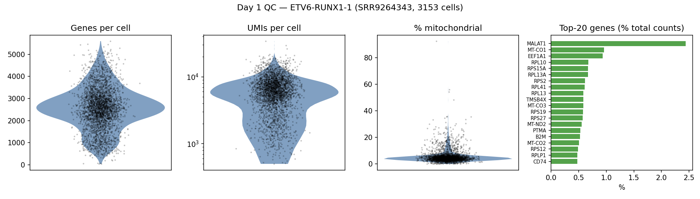
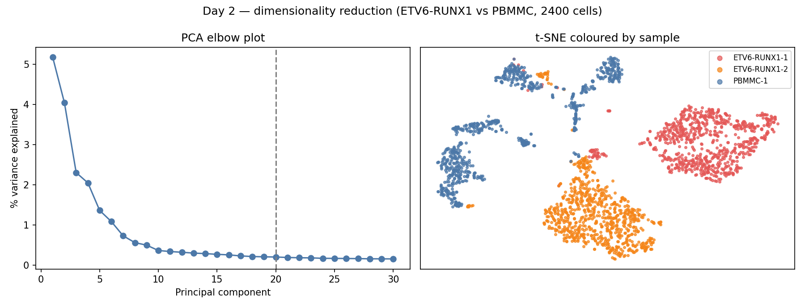
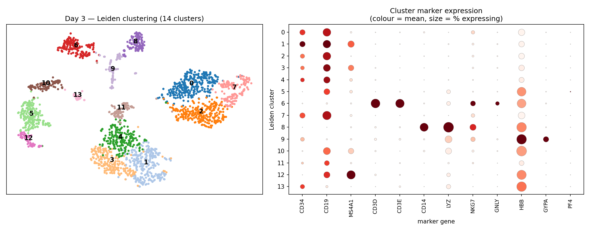
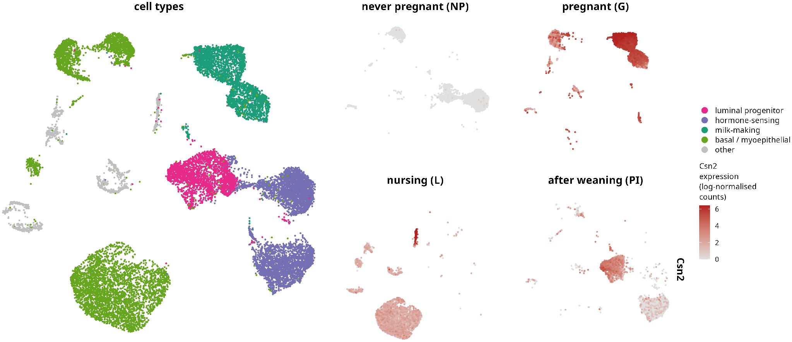
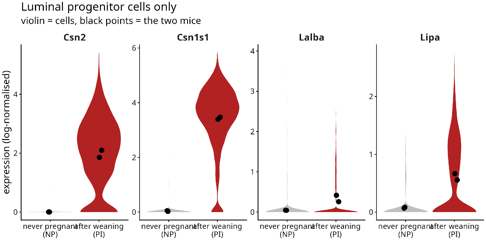

# Single-cell RNA-seq: From Count Matrices to Cell Types and Differential Analysis

This document summarizes Cambridge Week 3, which covers the analysis of single-cell RNA sequencing (scRNA-seq) data in R using the **Seurat v5** ecosystem. The week builds the full workflow — aligning reads and calling cells with Cell Ranger, quality control, normalisation and feature selection, dimensionality reduction, batch correction and integration, clustering, marker-gene identification, and finally differential expression and differential abundance between conditions. The instructor-led example uses a childhood B-cell acute lymphoblastic leukaemia dataset comparing ETV6-RUNX1 patient cells with healthy paediatric bone-marrow mononuclear cells (PBMMC) (Caron et al., 2020).

## Day 1: Single-cell Technologies, Cell Ranger & Quality Control

### Introduction and Cell Ranger
Droplet-based platforms (e.g. 10x Genomics) capture thousands of individual cells, tagging every transcript with a **cell barcode** and a **unique molecular identifier (UMI)** so that reads can be assigned back to their cell of origin and PCR duplicates collapsed. **Cell Ranger** aligns the reads, counts UMIs per gene per barcode, and performs **cell calling** — separating barcodes that contain real cells from the many empty droplets that contain only ambient RNA. The result is a sparse gene-by-cell count matrix (`matrix.mtx`, `barcodes.tsv`, `features.tsv`) that is the starting point for downstream analysis.

### Quality control and exploratory analysis
The count matrix is read into a **Seurat object** with `Read10X()` + `CreateSeuratObject()`. Not every called barcode is a good-quality cell, so QC removes likely debris and dying cells. Three metrics drive this: the number of genes detected per cell (`nFeature_RNA`), the total UMI count per cell (`nCount_RNA`), and the **percentage of mitochondrial reads** (a high fraction indicates a stressed or lysing cell). Rather than fixed cutoffs, thresholds are often set adaptively (e.g. a number of median absolute deviations from the median), and the most highly expressed genes are inspected to spot ambient-RNA or contamination problems.

```R
# Day 1: Load a Cell Ranger matrix into Seurat and apply QC
library(Seurat)
library(tidyverse)

# --- Read the filtered count matrix and build a Seurat object ---
counts <- Read10X(data.dir = "Data/CellRanger_Outputs/SRR9264343/outs/filtered_feature_bc_matrix/")
sobj   <- CreateSeuratObject(counts = counts, project = "ETV6_RUNX1_1")

# --- Basic per-cell diagnostics ---
raw_counts     <- sobj[["RNA"]]$counts
genes_per_cell <- colSums(raw_counts > 0)
plot(density(genes_per_cell), xlab = "Genes per cell", main = "")

# --- Mitochondrial content flags stressed / dying cells (human genes: ^MT-) ---
sobj[["percent.mt"]] <- PercentageFeatureSet(sobj, pattern = "^MT-")
VlnPlot(sobj, features = c("nFeature_RNA", "nCount_RNA", "percent.mt"), ncol = 3)

# --- Adaptive QC filtering (median absolute deviation) ---
is_outlier <- function(x, nmads = 3) {
  x < median(x) - nmads * mad(x) | x > median(x) + nmads * mad(x)
}
sobj <- subset(sobj, subset = !is_outlier(nFeature_RNA) &
                              !is_outlier(nCount_RNA) &
                              percent.mt < 10)
sobj
```



QC diagnostics for the ETV6-RUNX1-1 sample (3,153 cells): the distributions of genes and UMIs per cell and the mitochondrial fraction identify low-quality cells, while the highest-expressed genes are dominated by MALAT1, mitochondrial, and ribosomal transcripts — the expected profile for a healthy library.

## Day 2: Normalisation, Feature Selection, Dimensionality Reduction & Integration

### Normalisation and feature selection
Raw UMI counts differ between cells largely because of sequencing depth, so they must be normalised before cells can be compared. The course uses **`SCTransform`**, a regularised negative-binomial model that simultaneously normalises, stabilises variance, and returns Pearson residuals. Because most genes carry little cell-to-cell signal, analysis is restricted to the **highly variable genes** — those whose variance exceeds what technical noise alone would predict (visualised on a mean-variance plot) — which sharpens biological structure and speeds computation.

### Dimensionality reduction
Even after feature selection the data have thousands of dimensions, so **principal component analysis (PCA)** compresses them into a handful of components capturing the main axes of variation; an **elbow plot** helps choose how many PCs to keep. These PCs then feed non-linear embeddings — **t-SNE** and **UMAP** — which place transcriptionally similar cells near each other in 2D for visualisation (tuned by parameters such as perplexity or the number of neighbours).

### Batch correction and integration
When samples are processed in separate batches, technical differences can dominate over biology and pull identical cell types apart. **Integration** aligns shared cell populations across batches while preserving genuine differences. The course applies **Harmony** (via Seurat's `IntegrateLayers`), which iteratively adjusts the PCA embedding so that cells of the same type from different samples overlap, giving a corrected space for clustering.

```R
# Day 2: SCTransform, PCA/UMAP, and Harmony integration
library(Seurat)

# --- Normalise + select variable genes with SCTransform ---
sobj <- SCTransform(sobj, vars.to.regress = "percent.mt", verbose = FALSE)

# --- Linear reduction (PCA) and pick the number of components ---
sobj <- RunPCA(sobj, features = VariableFeatures(sobj))
ElbowPlot(sobj, ndims = 50)

# --- Non-linear embeddings for visualisation ---
sobj <- RunTSNE(sobj, reduction = "pca", dims = 1:10, perplexity = 30)
sobj <- RunUMAP(sobj, reduction = "pca", dims = 1:20)
DimPlot(sobj, reduction = "umap", group.by = "SampleName")

# --- Integrate across samples with Harmony to remove batch effects ---
sobj[["RNA"]] <- split(sobj[["RNA"]], f = sobj$SampleName)
sobj <- IntegrateLayers(sobj, method = HarmonyIntegration,
                        orig.reduction = "pca", new.reduction = "harmony")
sobj <- RunUMAP(sobj, reduction = "harmony", dims = 1:20,
                reduction.name = "umap.harmony")
```



The elbow plot shows variance dropping off after the first ~15-20 PCs, guiding how many to retain. On the t-SNE, the two ETV6-RUNX1 leukaemia samples separate from each other and from the healthy PBMMC cells — exactly the kind of sample-driven structure that motivates the batch-correction and integration step.

## Day 3: Clustering, Marker Genes, Differential Expression & Abundance

### Cell clustering
Cells are grouped into transcriptional clusters with a **graph-based** approach: `FindNeighbors` builds a shared-nearest-neighbour graph on the (integrated) PCs, and `FindClusters` partitions it with a community-detection algorithm (Louvain/Leiden). The **resolution** parameter controls granularity — higher values yield more, finer clusters — so it is usually swept across several values and judged against known biology.

### Cluster marker genes
Clusters are only useful once they are identified. **Marker genes** — genes preferentially expressed in one cluster — are found with `FindAllMarkers` (each cluster vs the rest) or `FindMarkers` (specific comparisons), then visualised with `FeaturePlot`, `VlnPlot`, `DotPlot`, and `DoHeatmap`. Matching these markers to canonical cell-type signatures assigns a biological label to each cluster.

### Differential expression and differential abundance
Two complementary questions compare conditions. **Differential expression** asks which genes change *within a cell type* between conditions; the recommended approach aggregates counts into **pseudobulk** profiles per sample-per-cluster and tests them with bulk RNA-seq tools, which correctly treats the biological replicate (the sample) as the unit. **Differential abundance** asks whether the *proportions* of cell states shift between conditions; **Milo** tests this on overlapping neighbourhoods of the KNN graph (`buildGraph`, `makeNhoods`, `testNhoods`), detecting compositional changes without relying on discrete cluster boundaries.

```R
# Day 3: Clustering, markers, and differential abundance (Milo)
library(Seurat)
library(miloR); library(SingleCellExperiment)

# --- Graph-based clustering at a chosen resolution ---
sobj <- FindNeighbors(sobj, reduction = "harmony", dims = 1:20)
sobj <- FindClusters(sobj, resolution = 0.5)
DimPlot(sobj, reduction = "umap.harmony", label = TRUE)

# --- Marker genes for each cluster, then visualise ---
markers <- FindAllMarkers(sobj, only.pos = TRUE, min.pct = 0.25)
DotPlot(sobj, features = unique(markers$gene[1:20])) + coord_flip()

# --- Differential abundance with Milo on the KNN graph ---
milo <- Milo(as.SingleCellExperiment(sobj))
milo <- buildGraph(milo, k = 30, d = 20, reduced.dim = "HARMONY")
milo <- makeNhoods(milo, prop = 0.1, k = 30, d = 20, refined = TRUE)
milo <- countCells(milo, meta.data = colData(milo), samples = "SampleName")
da   <- testNhoods(milo, design = ~ SampleGroup, design.df = nhood_design)
```



Graph-based Leiden clustering resolves 14 clusters. The marker dot plot (colour = mean expression, size = % of cells expressing) assigns them to cell types: most clusters are CD34+/CD19+ B-lineage blasts (the leukaemia), with a clear T-cell cluster (CD3D/CD3E), a monocyte cluster (CD14/LYZ), a mature B-cell cluster (MS4A1), and an erythroid cluster (HBB/GYPA).

## Day 4 & 5: My Project — Parity Memory in the Mouse Mammary Gland

### Overview
For the self-directed project I reanalysed **Bach et al. (2017)** (GEO **GSE106273**), a single-cell atlas of the mouse mammary gland sampled at four developmental stages — nulliparous (never pregnant), gestation (pregnant), lactation (nursing), and post-involution (11 days after weaning) — with two mice per stage. My analysis (`Week3_Figures.R`) follows the course workflow and asks a focused question: **after the gland builds a milk factory and tears it down again, does it truly return to its starting state?**

### Pipeline
I imported the eight Cell Ranger matrices with `ReadMtx` (the v2 output names the gene file `genes.tsv.gz`, which trips up `Read10X`), and validated the load against the paper: **25,806 cells (4,376 NP, 6,021 G, 9,603 L, 5,806 PI)** — matching their Methods exactly, which is my go/no-go check that nothing downstream is built on a broken import. QC used per-sample adaptive filtering (2 MAD on genes and UMIs, mouse mitochondrial genes `^mt-`, < 5% mitochondrial), followed by `SCTransform`, PCA/UMAP on 20 PCs, and Leiden clustering at resolution 0.4. I deliberately did **not** integrate: each stage is its own 10x run, so "batch" and "stage" are the same variable and correcting for one would erase the other. Luminal progenitors were identified from canonical markers (Aldh1a3, Kit, Elf5, Cd14, Plet1) rather than `FindAllMarkers`, because ambient milk RNA in lactating samples makes marker ranking unreliable.

### Main finding — the reset is only skin-deep
The two figures tell opposite stories on purpose. Looking at the milk gene **Csn2** across the whole gland, it switches cleanly off → on → on → off, so the tissue *appears* to reset completely after weaning.



But measuring the same genes **specifically in the luminal progenitor cells** tells a different story: after weaning they do **not** return to baseline. Csn2 is expressed in under 1% of progenitors before pregnancy but 82% after weaning, and Csn1s1 goes from 3% to 94%. The progenitors keep the milk programme partly switched on — a **transcriptional memory of having been through pregnancy and lactation**, exactly the parity-memory effect Bach et al. report. A specificity control (progenitors vs all other cells in the same post-involution mice) rules out ambient-RNA contamination as the explanation.



Each figure plots one point per mouse over the cell violins, keeping the n = 2 biological replicates visible rather than hidden behind thousands of cells. This slide-2-contradicts-slide-1 structure was the core of my presentation.

```R
# Project: Bach et al. mammary gland — parity memory in luminal progenitors
library(Seurat); library(tidyverse)
stage_levels <- c("Nulliparous", "Gestation", "Lactation", "Post-involution")
memory_genes <- c("Csn2", "Csn1s1", "Lalba", "Lipa")

# --- Load 8 Cell Ranger v2 matrices with ReadMtx (Read10X fails on v2 naming) ---
read_one <- function(gsm, sample_name) {
  d <- file.path(data_dir, gsm, "outs", "filtered_feature_bc_matrix")
  m <- ReadMtx(mtx = file.path(d, "matrix.mtx.gz"),
               features = file.path(d, "genes.tsv.gz"),
               cells = file.path(d, "barcodes.tsv.gz"), feature.column = 2)
  colnames(m) <- paste(sample_name, colnames(m), sep = "_"); m
}
counts <- do.call(cbind, map2(sampleinfo$sra_run, sampleinfo$sample, read_one))
sobj <- CreateSeuratObject(counts, project = "MammaryGland", min.cells = 1)

# Confirm the load against the paper's reported cell counts (go / no-go)
paper_counts <- c(Nulliparous = 4376, Gestation = 6021,
                  Lactation = 9603, `Post-involution` = 5806)
stopifnot(all(table(sobj$SampleGroup)[names(paper_counts)] == paper_counts))

# --- QC (mouse mito ^mt-, 2 MAD, <5% mito), SCTransform, cluster (no integration) ---
sobj[["percent.mt"]] <- PercentageFeatureSet(sobj, pattern = "^mt-")
sobj <- SCTransform(sobj, vars.to.regress = "percent.mt", verbose = FALSE)
sobj <- RunPCA(sobj) |> RunUMAP(dims = 1:20) |>
        FindNeighbors(dims = 1:20) |> FindClusters(resolution = 0.4, algorithm = 4)

# --- Figure 1: Csn2 across the four stages (whole gland) ---
FeaturePlot(sobj, features = "Csn2", split.by = "Stage",
            keep.scale = "all", max.cutoff = "q99", order = TRUE)

# --- Figure 2: milk genes in luminal progenitors only, NP vs PI, per-mouse points ---
prog <- subset(sobj, IsProgenitor & SampleGroup %in% c("Nulliparous", "Post-involution"))
prog_expr <- FetchData(prog, vars = c(memory_genes, "SampleGroup", "SampleName"),
                       layer = "data") |>
  pivot_longer(all_of(memory_genes), names_to = "gene", values_to = "expr")
per_mouse <- prog_expr |> group_by(gene, SampleGroup, SampleName) |>
  summarise(mean_expr = mean(expr), pct = 100 * mean(expr > 0), .groups = "drop")
ggplot(prog_expr, aes(SampleGroup, expr, fill = SampleGroup)) +
  geom_violin(scale = "width") +
  geom_point(data = per_mouse, aes(y = mean_expr), size = 3) +
  facet_wrap(~ gene, nrow = 1, scales = "free_y")
```

The figures above are from my Day 5 presentation slides; the full analysis is in `project/Week3_Figures.R`.

# URLs
- Week 3 programme & timetable: https://sites.google.com/cam.ac.uk/kaust-summer-school-2026/programme/week-3
