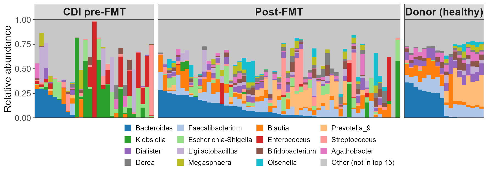
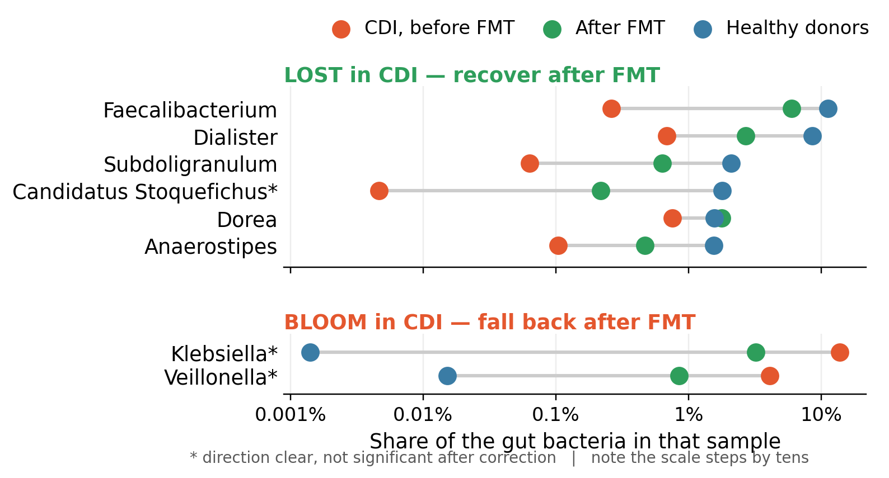

# Metagenomics: Amplicon and Shotgun Profiling of Microbial Communities

This document summarizes Cambridge Week 4, a three-day introduction to metagenomics — sequencing and analysing the DNA of whole microbial communities rather than a single cultured organism. The week moves from amplicon (16S rRNA) profiling through shotgun metagenomics, covering read quality control, k-mer/database-based taxonomic profiling, alignment to reference genomes, de novo assembly of mixed communities, and the recovery and quality-assessment of metagenome-assembled genomes (MAGs). The 16S practical uses R (`dada2`/`phyloseq`); the shotgun practicals are command-line workflows.

## Day 1: Introduction to Metagenomics & Amplicon 16S Analysis

### Introduction, biases, and amplicon sequencing
Metagenomics reads the DNA of an entire community, so the first lectures frame *what can and cannot be concluded* from it: every step — DNA extraction, primer choice, PCR amplification, sequencing depth, and reference databases — introduces biases that shape the apparent composition. **Amplicon (marker-gene) metagenomics** targets a single conserved gene, most commonly the bacterial **16S rRNA** gene, whose alternating conserved and variable regions let a universal primer amplify essentially all bacteria while the variable regions (e.g. V4) distinguish taxa. It is cheap and well-referenced, but only resolves *who is there* (typically to genus), not *what they can do*.

### Analysis of 16S data with DADA2
The 16S practical processes raw paired-end reads into a table of exact sequence variants. **DADA2** inspects read-quality profiles, applies `filterAndTrim` with per-read truncation, learns a sample-specific error model (`learnErrors`), denoises reads into **amplicon sequence variants** (`dada`), merges read pairs, builds a sequence-by-sample table, and removes chimeras. Taxonomy is assigned against a reference (SILVA), and the result is assembled into a **`phyloseq`** object that couples the abundance table, taxonomy, and sample metadata for downstream diversity and composition analysis.

```R
# Day 1: 16S amplicon workflow with DADA2 -> phyloseq
library("dada2"); library("phyloseq"); library("Biostrings"); library("tidyverse")

# --- Locate paired-end reads and derive sample names ---
path  <- "amplicon_16S"
fnFs  <- sort(list.files(path, pattern = "_1.fastq.gz", full.names = TRUE))
fnRs  <- sort(list.files(path, pattern = "_2.fastq.gz", full.names = TRUE))
sample.names <- str_remove(basename(fnFs), "_1.fastq.gz")

# --- Inspect quality, then quality-filter and truncate ---
plotQualityProfile(fnFs[1:3])
out <- filterAndTrim(fnFs, filtFs, fnRs, filtRs,
                     truncLen = c(240, 160), maxEE = c(2, 2),
                     rm.phix = TRUE, multithread = TRUE)

# --- Learn error model, denoise to ASVs, merge pairs ---
errF <- learnErrors(filtFs, multithread = TRUE)
errR <- learnErrors(filtRs, multithread = TRUE)
dadaFs <- dada(filtFs, err = errF, multithread = TRUE)
dadaRs <- dada(filtRs, err = errR, multithread = TRUE)
mergers <- mergePairs(dadaFs, filtFs, dadaRs, filtRs)

# --- Sequence table, chimera removal, taxonomy ---
seqtab         <- makeSequenceTable(mergers)
seqtab.nochim  <- removeBimeraDenovo(seqtab, multithread = TRUE)
taxa <- assignTaxonomy(seqtab.nochim, "silva_nr99_v138.1_wSpecies_train_set.fa.gz")

# --- Build a phyloseq object and summarise diversity/composition ---
ps <- phyloseq(otu_table(seqtab.nochim, taxa_are_rows = FALSE),
               sample_data(metadata), tax_table(taxa))
alpha_div     <- microbiome::alpha(ps, index = c("Chao1", "Shannon"))
ps_composition <- microbiome::transform(ps, "compositional")
```

## Day 2: Quality Control, K-mer/Database Methods & Alignment-based Metagenomics

### QC and file formats
Shotgun metagenomics sequences all the DNA in a sample, so the first step is standard read **quality control** — `FastQC` to inspect per-base quality, adapter content and duplication, followed by trimming/filtering (e.g. `fastp`) and re-checking. The lecture also covers the relevant file formats (FASTQ, FASTA, SAM/BAM, VCF) that thread through the whole pipeline.

### K-mer and database-based profiling
Rather than assembling anything, **k-mer methods** profile a community by matching short sub-sequences (typically 14–30 nt) against reference databases. **MASH** reduces genomes and read sets to small "sketches" of random k-mers and estimates similarity extremely quickly, while **Kraken2** (often with **Bracken** for abundance re-estimation) assigns reads to taxa using a k-mer-to-lowest-common-ancestor database. These give fast community composition without alignment, at the cost of database dependence.

### Alignment-based metagenomics: finding a known genome
When the question is "is a *specific* organism present, and at what coverage?", reads are aligned to a reference genome. The practical builds a **`bowtie2`** index of a *Shigella* reference, aligns the trimmed reads, and processes the output with **`samtools`** (SAM→sorted BAM, indexing, coverage), comparing default and tuned alignment settings.

```bash
# Day 2: QC, k-mer profiling, and reference alignment (shell)
# --- Quality control ---
fastqc raw_R1.fastq.gz raw_R2.fastq.gz
fastp -i raw_R1.fastq.gz -I raw_R2.fastq.gz \
      -o trim_R1.fastq.gz -O trim_R2.fastq.gz    # filter + trim adapters

# --- MASH: sketch and compare k-mers ---
mash sketch -k 21 -s 1000 -o refDB reference_genomes/*.fa
mash dist refDB.msh trim_R1.fastq.gz

# --- Kraken2 + Bracken: database-based taxonomic profiling ---
kraken2 --db k2_standard --paired trim_R1.fastq.gz trim_R2.fastq.gz \
        --report sample.kreport --output sample.kraken
bracken -d k2_standard -i sample.kreport -o sample.bracken -r 150 -l G

# --- Alignment to a known genome (Shigella) with bowtie2 + samtools ---
bowtie2-build -q NZ_CP034931.fa shigella_genome
bowtie2 -p 8 --no-unal -x shigella_genome \
        -1 trim_R1.fastq.gz -2 trim_R2.fastq.gz -S aln.sam
samtools sort -@ 4 -O BAM -o aln.sorted.bam aln.sam
samtools index aln.sorted.bam
```

## Day 3: De Novo Assembly & Metagenome-Assembled Genomes (MAGs)

### De novo metagenomic assembly
When no suitable reference exists, communities are reconstructed **de novo**: overlapping reads are assembled into contigs with a metagenome-aware assembler such as **metaSPAdes** (or MEGAHIT). Because a community mixes many genomes at very different abundances, the lecture also covers strategies that help — **hybrid sequencing** (combining accurate short reads with long reads that span repeats) and **Hi-C**, which uses physical DNA proximity to link contigs that belong to the same cell.

### Working with MAGs
Assembly produces a tangle of contigs from many organisms, so **binning** groups them into putative genomes. The practical uses **MaxBin2**, which clusters contigs by tetranucleotide composition and coverage into **metagenome-assembled genomes (MAGs)**. Each MAG's quality is then assessed with **CheckM** (completeness and contamination from single-copy marker genes) and its taxonomy assigned with **GTDB-Tk** against the Genome Taxonomy Database — the two standard tools for judging whether a recovered genome is trustworthy and what it is.

```bash
# Day 3: de novo assembly, binning, and MAG quality/taxonomy (shell)
# --- Assemble the mixed community de novo ---
metaspades.py -t 8 -1 trim_R1.fastq.gz -2 trim_R2.fastq.gz -o ASSEMBLY/

# --- Bin contigs into MAGs by composition + coverage ---
maxbin2 -contig ASSEMBLY/contigs.fasta -reads trim_R1.fastq.gz \
        -out MAXBIN/bin -thread 8

# --- Assess MAG quality (completeness / contamination) ---
checkm taxonomy_wf domain Bacteria -x fasta MAXBIN/ CHECKM/
checkm qa CHECKM/Bacteria.ms CHECKM/ --file CHECKM/quality.tsv --tab_table -o 2

# --- Assign taxonomy against the Genome Taxonomy Database ---
gtdbtk classify_wf --genome_dir MAXBIN/ -x fasta \
       --out_dir GTDBTK/ --skip_ani_screen --cpus 8
```

## Mini Project — My Analysis: Does a Faecal Transplant Restore the Gut After *C. difficile* Infection?

### Overview
For the mini project I asked: **which gut bacteria are lost during a *Clostridioides difficile* infection (CDI), and does a faecal microbiota transplant (FMT) bring them back?** I used the `cdi_youngster` study (Youngster et al., 2014) from the **Duvallet et al. (2017)** meta-analysis — 100 stool samples from 23 people: 19 patients sampled before and after FMT, plus 4 healthy donors (16S rRNA V4, 100%-identity OTUs classified against SILVA v138.1, pooled into 286 genera). Because patients were sampled repeatedly, every analysis averages **per person first** so nobody is counted twice. The published data are already denoised (100%-identity OTUs are equivalent to DADA2 ASVs), so I joined the course workflow at `assignTaxonomy()` and continued through `phyloseq` exactly as in the Day 1 practical.

### Finding 1 — every patient's gut is broken differently, but donors all look alike
A stacked composition barplot shows that CDI guts share no common disrupted state: each patient is dominated by a *different* organism — one by *Klebsiella*, another by *Enterococcus*, another by *Escherichia-Shigella*. After FMT the communities diversify and shift toward the donor profile, and the healthy donors themselves look strikingly uniform (*Bacteroides*/*Faecalibacterium*/*Prevotella*-rich). Disease is disordered in many directions; health is one consistent state.



### Finding 2 — the fibre-fermenters come back; the invaders fall away
Comparing genera between CDI patients and donors (Wilcoxon test, Benjamini-Hochberg q < 0.05) found **53 genera differing — 51 depleted and only 2 enriched**. What is lost are fibre-fermenting anaerobes (*Faecalibacterium*, *Dialister*, *Subdoligranulum*, *Dorea*, *Anaerostipes*) that make butyrate, fuelling the colon lining and keeping the gut oxygen-free. What blooms are opportunists (*Klebsiella*, *Veillonella*) that thrive once that anaerobic state collapses. After FMT the anaerobes return — though not fully — and the invaders recede, which is the mechanistic story behind why FMT cures recurrent CDI.



```R
# Mini project: CDI vs FMT vs donor — phyloseq + vegan
library("phyloseq"); library("vegan"); library("tidyverse")

# Join the course workflow at taxonomy assignment (data already denoised)
taxa <- assignTaxonomy(seqs, "silva_nr99_v138.1_wSpecies_train_set.fa.gz")
ps   <- phyloseq(otu_table(counts, taxa_are_rows = FALSE),
                 sample_data(metadata), tax_table(taxa))

# --- Alpha diversity on evenly-rarefied counts, averaged per person ---
rarefied <- rrarefy(counts[rowSums(counts) >= 2000, ], 2000)
alpha    <- data.frame(Shannon = diversity(rarefied, index = "shannon"),
                       Group = metadata$Group, subject = metadata$subject)
per_patient <- aggregate(Shannon ~ subject + Group, data = alpha, FUN = mean)

# --- Per-genus Wilcoxon test, CDI patients vs donors, BH-corrected ---
compare_genera <- function(mat, g1, g2) {
  res <- data.frame(genus = colnames(mat), p = NA_real_)
  for (i in seq_along(res$genus))
    res$p[i] <- suppressWarnings(wilcox.test(mat[g1, i], mat[g2, i])$p.value)
  res$q <- p.adjust(res$p, method = "BH"); res
}

# --- Community-level: NMDS ordination + PERMANOVA ---
rel  <- transform_sample_counts(ps, function(x) x / sum(x))
ord  <- ordinate(rel, method = "NMDS", distance = "bray")
perm <- adonis2(phyloseq::distance(rel, "bray") ~ Group, data = md, permutations = 999)
```

The figures above are from my presentation slides; the full analysis is in `project/cdi_fmt_analysis.R`.

# URLs
- Week 4 programme & timetable: https://sites.google.com/cam.ac.uk/kaust-summer-school-2026/programme/week-4
